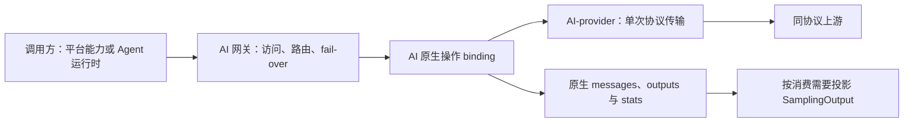

# AI 服务与 AI 网关：职责、契约与实现复核

状态：2026-10-05 重新整理需求并审计实现。产品边界以 [PRD](../prd/index.md#ai-网关与-agent-运行时配置) 为准；本页区分已确认要求、审计后的技术建议与当前代码，不能由设计描述推定能力已交付。具体证据和迁移切片归 [AI 网关审计任务](../../tasks/ai-gateway-audit/packet.md)。

## 已确认需求

AI 服务是独立 lib，其领域不限于 LLM；sampling 是一项操作，不是整个 AI 服务的基础模型。AI 服务与 Agent 运行时保持独立，提供商协议和 SDK 由具体 adapter 封装。读取运行时提供商配置属于 application 与运行时 adapter 的导入用例，不使 AI 服务依赖 Harness 的模型目录、认证文件或推理级别。

AI 网关承担同协议原生透传、模型路由与 fail-over，当前不做协议转换或翻译。名称为 AI 网关；Harness 是它的一类调用方，不定义它的领域边界。当前产品协议范围为 OpenAI ChatCompletions v1 与 Responses v1，不以这些操作限制整个 AI 服务未来的领域，也不将尚未实现的 Messages 等协议视为已交付。

请求中的原生历史、参数、内容和响应事件必须保留。路由可改变逻辑模型标识对应的上游模型和认证目标；这些必要变更不能成为重写其它协议内容的理由。参数以提供商协议为权威，输出上限与推理级别只是相应模型参数的例子，不能要求每个提供商都具有同一组 token 或 reasoning 字段。无法保持请求含义时明确拒绝，不静默删除字段、补参数、降低推理级别或钳制输出上限。

AI 提供商与模型分别建模：模型跨提供商存在，提供商关联多个模型；具体外部标识、协议、端点和执行能力归提供商绑定。认证来源可以显式委托原运行时的设施，原配置保留；秘密不复制到普通配置。配置持久化与平台设施由 application 装配，领域包不自行读取全局环境、配置或认证文件。平台 app 同进程消费 UniFFI 类型接口，领域包不依赖 UniFFI。

## 目标职责与技术建议

下表为基于已确认需求的技术建议；公共类型和具体迁移仍需实施复核，不表示已改源码。

| Unit／边界 | 应负责 | 不应承担 |
| --- | --- | --- |
| ai | 各操作的调用方／provider 契约，原生内容封装，错误与生命周期语义 | HTTP、配置存储、Harness 规则；以 LLM 消息或 token 定义所有操作 |
| ai-provider | 对确定目标执行一次协议操作，认证应用、HTTP、原生响应与终态观察 | 路由选择、fail-over、隐藏重试；以某一厂商的采样 decoder 定义另一厂商的原生协议 |
| gateway | 入口访问控制、模型解析、路由快照、请求约束、fail-over 和下游响应提交 | sampling 往返重建、会话或工具执行、Pi 配置解释 |
| application | 配置仓库、秘密解析设施、跨域装配、导入与运行生命周期用例 | 再造协议 decoder 或要求 UI 补偿业务约束 |
| agent-runtime adapter | Harness 原生配置、身份、模型能力和来源兼容设置的投影 | 接管 AI 网关路由权，或把 Pi 参数变成 AI 服务通用参数 |

接口围绕独立协议操作及不可变绑定组织，provider 可组合多个操作能力；不要求每种提供商实现一个包含所有操作的巨型 trait。`SamplingOutput` 可以作为原生协议业务数据的消费投影，但不因此要求建立独立 sampling 执行操作，更不作为 AI 网关的中间协议。现有 sampling 执行合同属于历史实现，是否保留取决于实际调用需求。

处理链为 HTTP → 原生 ChatCompletions 协议数据 → messages、outputs 与协议统计；需要统一业务结果的调用方可以从 outputs／stats 派生 `SamplingOutput`。这里表示数据处理方向，不表示协议领域类型需要依赖 HTTP crate。协议内的 usage、finish reason 等属于业务结果，不能因为它们可用于统计就归入可观测性。调用耗时、路由尝试、配置版本、提交阶段、取消和执行错误阶段等观察信息独立于业务数据，通过关联 ID 连接；观察侧可提取必要的 usage 指标，但不拥有或替代原始业务统计。不创建要求所有 AI 能力都有 model/token 的通用观察对象。

协议实现按 ChatCompletions、Responses 等协议组织，不按 MiniMax 等服务商组织。服务商名称、端点和模型标识是配置数据，不能据此选择不同的通用执行路径。确有服务商特有的认证或协议差异时，只在对应边界显式处理并说明依据，不让其成为其它服务商的依赖。

HTTP 传输、SSE 分帧、JSON 解析与采样结果映射是不同职责。原代码名为 `Decoder` 的对象实际将已解析的 JSON chunk 映射并组装成 sampling 结果，不是字节转字符串组件。原生透传仍需要处理 HTTP／SSE 边界，并为路由、校验与观察读取必要字段；不应因此把整个原生响应投影为 sampling 子集或重建它。

原生内容以受保护的 Payload 封装，具名类型表达操作身份、必需字段、调用结果和生命周期。协议模块负责协议校验及观察，AI 网关组合访问、路由与配置约束，避免重复维护两套协议 schema。保真以非路由字段和响应事件的内容、顺序及含义为准，不要求 JSON 空白与成员顺序不变。未知扩展不因不进入采样模型而丢弃；非法输入、必要资源限制与认证协议限制仍需明确处理。透传不是任意 HTTP 代理，端点及操作范围仍来自配置和具名入口。



## 路由、fail-over 与生命周期

路由捕获一次请求的配置版本、提供商／模型目标和认证引用；热编辑不能改变正在执行的尝试。持久配置、已装配运行配置与正在执行的快照必须有明确的版本和生效规则。Harness 的历史兼容身份由运行时 adapter 管理，不把 Pi 物理绑定 ID 作为通用路由模型；请求中的来源身份约束仍应参与目标资格判断。

fail-over 由 AI 网关单独决策，provider 执行一次尝试，不隐藏再次请求。相同协议只是一项资格条件，不足以证明历史、文件、缓存、加密推理或服务端状态引用可交给另一提供商／账户／模型。目标必须能接受相同请求及其已有状态，不能为了切换而改变请求含义。

建议按失败阶段、是否可能已提交、是否已向调用者提交响应以及候选资格决定下一次尝试。向下游提交一个上游响应后，不切换目标或拼接两个流；取消结束本次调用，不触发 fail-over，也不声称撤销已发生的上游执行。不得通过缓存完整流扩大切换窗口。自动候选范围、切换条件和不确定提交下是否允许重复执行属于需要明确的产品策略；当前 fail-over 仍禁用，不将职责确认冒充实现。

协议终态与传输结束分别观察。保留原生 completed、incomplete、failed、finish reason 等含义；HTTP 200、EOF 或客户端没有收到事件不能独自证明完整成功或未执行。断连应有可传播的取消与有界清理，凭据解析、连接、流和资源关闭不能依赖无限等待。使用量不足时保持未知，不补零，不要求所有操作都有 token 计量。

日志与观察只记录关联 ID、目标身份、阶段、提交状态、耗时和安全错误码，默认不记录原生正文、历史或认证。具体日志装配归 [架构](architecture.md#本地可观测性装配) 与 [开发说明](../development.md#本地诊断)。

## 当前实现与证据

ChatCompletions 当前仍经 SamplingInput／SamplingDelta 重建，请求参数、assistant 历史和推理流不能保真；通用 OpenAI adapter 复用有界 MiniMax decoder。该路径不符合已确认的 AI 网关边界。[导入验收](../../tasks/pi-mac-first-loop/deepseek-import-acceptance.md)使用已安装库复现正常入口被拒绝，并以 SDK 多轮及隔离网关请求定位实际缺口。

Responses 已有独立原生 body／SSE 路径，但不能据此认为整个响应、观测、取消与生命周期都已满足目标。HTTP 状态和响应头、终态观察、提交阶段及清理边界继续按 [审计任务](../../tasks/ai-gateway-audit/packet.md) 的证据复核。当前只做显式静态路由；自动策略与 fail-over 尚未实现。

MiniMax 的固定端点、模型、采集预算与 replay 只描述原有有界 sampling adapter，不构成通用 AI 网关的能力证据。sampling 的范围本身可以保留，其是否调整由实际调用方决定，不为复用既有代码而限制原生协议。

## Harness 提供商配置导入

提供商配置导入是一项完整功能，覆盖来源中的提供商、协议、端点、有效模型及能力参数，并包含认证来源。认证解析不是另一项可以代替导入的交付。Core 适配器提供非秘密预览与应用动作，平台 UI 依据通用描述展示来源和候选项，不解释 Pi 配置。

首个适配器固定读取 Pi 1.0.2 的有效配置。用户选择已配置的运行时实例；application 在预览和应用时重新解析该实例的目录与执行配置，不接受调用方覆盖路径。实例或来源变化使旧预览失效。读取不要求运行时先连接或已有默认模型。预览不执行配置中的凭据命令、不刷新认证、不访问模型服务。提供商按实际端点与协议分组；无法由当前网关保持语义的配置须显示原因，不能默默剥离后声称支持。导入保留原文件；普通凭据引用原来源，OAuth 仍由来源适配器在原存储的锁内刷新，Velune 配置不保存秘密值。

Core 装配配置中的提供商模型映射可以携带 `piProjection`，其类型和转换归 Pi adapter；它不是通用 AI 模型能力。全局目录保留本轮对话操作的身份、显示和预算，Pi adapter 将允许级别与来源 Pi 级别求交，并保留 off→none 等 SDK 映射及九项 Responses 编码选项。适配器同时派生原生 Responses 的允许 effort 值域；网关只校验 wire 值，不理解 Pi 七级、不执行级别转换。投影变化进入物理绑定身份，来源派发重新核对同一投影。未知 compat、自定义 headers、采样参数及启用 session affinity 请求头的配置继续明确标记不支持，不声称完整请求头透传。

当前 Chat Completions 导入接受与现有重建路径相容的已知兼容设置，例如 `supportsStore: false`、`maxTokensField: "max_completion_tokens"` 和 `thinkingFormat: "openai"`，不因兼容对象非空而整体拒绝。**现有实现偏差：** 网关经 sampling 契约重新编码请求，提供商模型绑定以类型化 wire 选项选择 `max_tokens` 或默认的 `max_completion_tokens`；Pi 来源字段由 application 显式转换，不进入通用 AI 模型参数。禁用 `stream_options.include_usage`、禁用 `reasoning_effort` 或使用尚未实现的供应商推理参数格式的来源仍显示具体原因。适配器同时检查 Pi 1.0.2 从原提供商与 URL 推断的相关默认值；改成受管提供商和本地网关地址不能消除来源的请求要求。这一判定绑定固定 SDK 版本，升级时须重新核对其默认推断与网关编码，不能沿用假定。Pi 新 ChatGPT 订阅仍使用受支持的 `openai-responses`；旧 `openai-codex-responses` 使用另一后端与认证契约，不作为普通 Responses 的别名。未实现的 Pi 协议按实际 API 标识说明，不将其附加为 Chat Completions 兼容问题。

`packages/ai` 与 AI provider lib 不引用 Pi 类型或任何 Harness 配置，独立 Responses 是已实现的一项协议操作，sampling 是另一项操作；这些具体操作不成为整个 AI 服务领域的基础模型。Mac 只编辑通用绑定字段并往返保留 Core 验证的适配元数据，不解释 Pi 投影。

来源配置在导入时形成快照，不做双向同步。重复项默认跳过，替换须明确选择；来源模型可以关联已有全局模型，但不覆盖该模型参数。导入不自动改变路由或运行时默认模型。应用前重新核对来源和目标配置，变化后要求重新预览；派发时核对保存的来源执行绑定，避免来源端点改变后将凭据发送到另一个目标。当前实现与人工验证记录见 [首循环任务](../../tasks/pi-mac-first-loop/packet.md)。


## 历史有界 sampling 与 MiniMax 实现

以下保留 2026-10-03 有界实现的契约和验收说明，仅适用于该操作与 adapter，不提升为原生 AI 网关或整个 AI 服务的统一约束。

## 两套契约与依赖

```text
app main → AiService::sampling(request, attempt_id, event_sink)
                  ↓ DirectAiService（单个 immutable binding）
       service-owned SamplingProvider::sampling(request, delta_sink)
                  ↑ MiniMax adapter implements
                  ↓ reqwest / SSE / Chat Completions
```

[velune-ai](../../packages/ai/src/lib.rs) 拥有调用方与 provider 两套权威契约，不依赖 provider crate、HTTP、SSE、厂商 JSON 或 SDK。provider 单向依赖 service；[MiniMax](../../packages/ai-provider/src/minimax/mod.rs) 映射外部协议，不再增加平级 sampling 执行服务。serde_json 在 service 中只表达调用方工具 schema／参数，不表示厂商 envelope。

`AiService::sampling` 同步校验目标并捕获 ProviderBinding，返回 Future；Future 被 poll 才派发。调用方传入独立 CallId 和 AttemptId；此步无全局 ID 生成器／去重库，调用方保证唯一。DirectAiService 不选择 provider、不重试／fallback。一个 provider Future 完成后，service 发恰好一个 Terminal 并返回 SamplingCompletion、CallObservation 和可选 AttemptObservation。未 poll／drop／panic 路径没有终态保证，不标为已验收的取消／恢复协议。

## 配置与装配

统一配置中心拥有持久配置，app main 创建新的 immutable provider／binding／service。两个 lib 不读 env、文件、全局配置，也不保存配置。[手动入口](../../packages/ai-provider/examples/minimax_manual.rs) 是本步 composition root：读取获准 Networksecret 占位、创建带标准环境代理及系统 TLS 校验的客户端，禁 retry／redirect，注入内存凭据。不是正式配置中心或产品入口。

ProviderConfig 保留协议、CredentialRef、模型映射、ProviderId／ConfigRevision。新增独立 ChatCompletionsConfig；Messages 仍仅配置形状；Responses 原生操作已实现，但其调用／尝试与流生命周期仍需本轮审计复核。MiniMax adapter 限定 HTTPS `api.minimax.cn:443/v1`、`MiniMax-M3`，`thinking:disabled`、`service_tier:standard`，不启用内置收费工具。HTTP 客户端的安全装配属于 app；adapter 接受已装配 client，不能从类型上证明任意第三方传入的 client 均关闭重试。

ProviderBinding::prepare 捕获 Arc 与 revision；adapter 自身也持有 immutable 配置和凭据，不重读配置。Arc 不证明其他 trait 实现无内部可变性；并发热切换、凭据轮换尚未实测。HttpEndpoint／ID 构造器仍是语法边界，不是完整网络安全策略。

## 流事件、结果与观测

SamplingDelta 仅表达 Text、ToolIdentity、ToolArguments、Finish、Usage；service 统一包装 AttemptContext 与递增 sequence。工具 index 是 attempt 内流组装索引；ID／名称与参数片段分开传递。参数仅在完成时解析为 JSON object，工具调用只返回、不执行。sink 同步消费提供自然背压，不启后台任务或无界 channel；用户 sink 应短小且不 panic。

Finish 是模型停止生成的原因，可能先于最后 usage；Terminal 表示整个操作结束。adapter 接受两种经校验终止：已解码的 `[DONE]`，或 clean transport EOF＋所有 SSE 行／帧闭合＋显式 finish＋已报告 input/output usage；两者都必须有完整有效输出／工具参数。后者由真实字节层诊断与官方推荐 OpenAI SDK 的自然迭代结束行为支持，并非把任意 EOF 当成功。缺少 finish／usage、未闭合帧、解析／传输错误、unsupported delta、identity 冲突等返回 typed failure，保留已知 usage 与 PartialSamplingOutput；半截参数保持字符串，不伪造完成工具调用或 finish。output limit 且工具参数不完整仍失败并保留 partial。

每个 usage 值独立 Unknown／Reported／Estimated，缺失不填零。当前 service 映射 prompt_tokens→input、completion_tokens→output；total_tokens 留 fixture，不当成另一个计费数量。其他 usage 扩展字段只记录存在性，未映射，不宣称无损覆盖缓存计量。

`submitted` 表示已调用 transport execute，不等于证明服务端接收；网络异常 execution 为 Unknown，HTTP 200 后 Accepted。无发送的 preflight 失败计 0 attempt，真实 transport submission 计 1。拒绝响应不保留原始错误 body。elapsed 用单调时钟；当前单次直接派发 call／attempt 耗时共享起点。

Payload Debug 脱敏正文及工具参数；观测无正文／headers／原始错误。显式内容访问与捕获仍由调用方授权，这不是防恶意调用者的安全沙箱。

## 依赖与运行边界

固定 reqwest 0.13.5、eventsource-stream 0.2.3（见 Cargo.lock），没有厂商 SDK 或 Web 框架。reqwest 默认会重试部分协议错误，所以手动入口显式 `retry(never)`，并 `redirect(none)`、HTTP/1、60 秒总期限、15 秒连接期限。SSE 前限制总字节 256 KiB；文本与单工具参数各 64 KiB，最多 16 个工具索引。请求 JSON 最大 4096 bytes、输出最大 1024 tokens；手动两例实际为 64／256。HTTP 请求和模型语义失败均不自动重派。

[官方 MiniMax 参数](https://platform.minimax.cn/docs/api-reference/text-openai-api)、[reqwest client](https://docs.rs/reqwest/0.13.5/reqwest/struct.ClientBuilder.html)、[SSE parser](https://docs.rs/eventsource-stream/0.2.3/eventsource_stream/) 于 2026-10-03 复核。代理占位按 [Cloud 官方契约](https://learn.chatgpt.com/docs/environments/cloud-environments#configure-environment-variables-and-network-secrets) 消费，不将变量名 literal 当凭据。

## 验收范围

静态检查与人工 live／replay 分开记录。fixture 是白名单协议记录，不是完整抓包：去除响应 ID、时间戳、fingerprint、headers、cookies、raw errors 及未知字段值；保留合成请求、model、文本／工具分片、finish、usage 与 `[DONE]` 顺序。捕获回调只缓存在内存；写 fixture 前按解码字符串、完整文本、按 index 拼接的工具参数及其内嵌 JSON 再检查凭据／占位回显。嵌入字符串解码失败或引号未闭合时 fail closed，不补引号猜测，也不跳过检查。拒绝时只保存固定元数据、typed usage／attempt 数及 capture_rejected 状态，不写正文、不格式化异常，保留预留。这个保守规则可能拒绝合法流中的不完整字符串片段；不影响模型输出契约，也不把 capture 拒绝改写成 provider 成功。此保护不声称能识别代理端未知真实值或任意编码的秘密。

手动 replay 在分支入口不构造 HTTP client、不读凭据，只把已保存的 projected records 送入同一个 Decoder，再经 service 包装；source 标为 replay，网络 attempt=0。expected 是独立人工审阅文件，不能由 mapper 自动更新。诊断样本保留旧 source mapping 的失败结果，新 expected 明确记录修正后的映射；replay 采用记录的 clean EOF／typed error 分类，保留实际 Decoder error kind 与 HTTP 接收状态。精确内容只是这次真实样本的回放 oracle，不是未来随机生成的质量断言。

未验收：并发热更新／凭据轮换、取消和 drop／panic 后终态、真实中断／429／重试故障注入、工具参数多片段／多工具并发、工具结果往返、厂商新增字段兼容、三 Harness／三 provider、全局预算协调／账单核对、正式配置中心和 Mac。静态通过或成功样本不替代这些运行证据。
