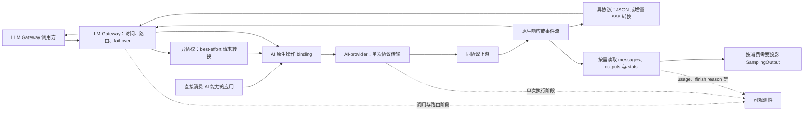

# AI 服务与 LLM Gateway：职责、契约与实现复核

状态：2026-10-06 三协议 best-effort 转换实施中；此前已于 2026-10-05 重新整理需求并审计实现。产品边界以 [PRD](../prd/index.md#ai-网关与-agent-运行时配置) 为准；本页区分已确认要求、审计后的技术建议与当前代码，不能由设计描述推定能力已交付。具体证据和迁移切片归 [AI 网关审计任务](../../tasks/ai-gateway-audit/packet.md)。

## 当前配置契约

2026-10-05 最新反馈明确：跨提供商模型共性的用途是参数模板，减少重复填写，不推出全局模型必须成为调用实体。提供商的协议、端点、model ID、API key 应可查看或编辑；独立认证管理页不再是目标。配置界面以提供商及其模型为中心，模板为快速填入能力，具体值以该提供商实际支持为准。

用户已认可归属并授权实施。提供商拥有模型条目及私有认证；模板保存填写字段，复制为独立配置快照，不在调用链保留 templateId 或传播修改。模板从现有配置保存或手动填写，不预置硬编码厂商目录。旧全局模型、模型关联映射、中央认证资源及 Keychain 接口已经 hard-cutoff 删除；实现与安装证据归当前任务。

## 已确认需求

AI 服务是独立 lib，其领域不限于 LLM；sampling 语义不作为整个 AI 服务的基础模型。AI 服务与 Agent 运行时保持独立，协议和 SDK 由具体 adapter 封装。读取运行时提供商配置属于 application 与运行时 adapter 的导入用例，不使 AI 服务依赖 Harness 的模型目录、认证文件或推理级别。

当前讨论和实现的 gateway 仅为 LLM Gateway，承担 LLM 协议的同协议原生透传、异协议 best-effort 转换、模型路由与 fail-over。2026-10-06 用户已授权三个现有协议全部双向转换；实现与验收状态见 [转换任务](../../tasks/llm-protocol-translation/packet.md)。它是 AI 模块的一种应用模式，不代表 AI 服务整体，也不是 Harness 专属网关；Harness 是它的一类调用方。此前文档中的“AI 网关”在当前范围内均指此 LLM Gateway。当前产品协议范围为 OpenAI ChatCompletions v1、Responses v1 与 Anthropic Messages。它们保持各自原生 HTTP／JSON／SSE 契约，不以这些操作限制整个 AI 服务未来的领域。Messages baseURL 追加 `/v1/messages`，同协议请求版本由调用方的 `anthropic-version` 决定，不重组业务正文；异协议转换为 Messages 时合成版本 `2023-06-01`。API key 使用原生 `x-api-key`，当前未核实的 subscription 认证在派发前拒绝。Pi／DSH 的 Messages 注入采用网关 origin，OpenAI 采用 `/v1`；Codex 适配器发给网关的协议仍是 Responses，上游可通过转换使用其它两个协议。隔离证据见 [本轮任务](../../tasks/settings-protocol-refinement/packet.md)。

AI 能力可以由应用直接调用，也可以由 LLM Gateway 组合后对外提供 HTTP 入口；直接消费不要求经过 gateway。应用模式是职责关系，不要求把 gateway 并入 `ai` package。现有独立 `gateway` unit 可以继续承担这一模式，依赖 AI 能力；AI 契约不反向依赖它。非 LLM 能力只按具体用例扩展，不预建其它网关或空领域框架。

请求中的原生历史、参数、内容和响应事件必须保留。路由可改变逻辑模型标识对应的上游模型和认证目标；这些必要变更不能成为重写其它协议内容的理由。同协议参数以提供商协议为权威；跨协议按 best-effort 映射并记录不含正文的转换诊断。输出上限与推理级别只是相应模型参数的例子，不能要求每个提供商都具有同一组 token 或 reasoning 字段。异协议转换不因无法完整表达某个字段而 fail-closed，尽量保留可用内容、映射参数并对降级或省略作静态诊断；不伪造历史、工具执行或上游成功。Anthropic 所需输出上限缺省来自目标模型配置，不使用固定常数；同协议路径不因此改写字段。

每个 AI 提供商拥有多个实际可调用的模型条目；跨提供商参数共性通过模板复用，不建立全局调用实体。协议、服务地址和认证归提供商，实际模型 ID、显示元数据及能力归其模型条目。隐藏内部记录键用于选择引用，网关别名是调用入口，两者不得冒充提供商规定的 model ID。领域包不自行读取全局环境、配置或认证文件；平台 app 同进程消费 UniFFI，领域包不依赖 UniFFI。

application 私有保存 API key 或 OAuth 来源定位，并向 gateway 注入中立异步解析器。gateway 捕获目标并解析本次认证，不接收 Harness 类型、路径、来源 JSON 或 helper CLI。AI-provider 只消费本次解析的短生命周期认证；当前协议固有的 Bearer 不需要额外选择。公开摘要仅描述 API key／OAuth 类型、配置状态、来源和动作，不能把 Pi 当作认证方式。

## 本轮实施契约

提供商模型条目拥有隐藏稳定记录键、提供商 API model ID、昵称／图标及实际可选能力；移除独立全局模型调用实体、关联映射与单目标必须配置的路由。修改 API model ID 时保留内部引用身份，网关派发精确上游 ID。协议由提供商持有；协议或端点编辑时校验现有订阅来源与 Pi 投影是否适用，明确处理冲突，不永久锁住字段或隐性使用旧执行投影。

认证随提供商配置保存，公开描述只有认证类型、配置状态、来源说明和可执行动作。API key 使用 application 私有配置记录，显式单条读取；保存将普通字段和认证编辑共同原子提交。认证编辑区分保留、更新 API key 和清除，取消草稿或读取失败不清空既有凭据。文件创建时使用 0600，列表、snapshot、Debug 和日志不包含 key。OAuth 保留原来源登录／刷新能力，中立 gateway resolver 不接收 Harness 来源类型。删除中央认证 CRUD、Keychain shim 和旧清理合同。

模板只复制名称、建议 API model ID、图标及可选能力，不复制认证、服务地址、内部记录键或 Pi 适配器投影。可用 effort 声明与当前请求 effort 分开，本轮恢复明确的能力编辑，不新增会话 effort 控制 API。提供商编辑器的信息架构与原生组件详见 [编辑器设计](../../tasks/ai-gateway-audit/provider-editor-design.md)。静态检查与行为验收分开记录；完成接口不等于已完成界面验收。

## 目标职责与技术建议

下表为基于已确认需求的技术建议；公共类型和具体迁移仍需实施复核，不表示已改源码。

| Unit／边界 | 应负责 | 不应承担 |
| --- | --- | --- |
| ai | 各操作的调用方／provider 契约，原生内容封装，错误与生命周期语义 | HTTP、配置存储、Harness 规则；以 LLM 消息或 token 定义所有操作 |
| ai-provider | 对确定目标执行一次协议操作，认证应用、HTTP、原生响应与终态观察；提供独立请求范围的 LLM 协议转换 | 路由选择、fail-over、隐藏重试；以某一厂商的采样 decoder 定义另一厂商的原生协议 |
| gateway（当前为 LLM Gateway） | LLM 入口访问控制、模型解析、路由快照、请求约束、转换装配、fail-over 和下游响应提交 | 定义整个 AI 服务；sampling 往返重建、会话或工具执行、Pi 配置解释 |
| application | 配置仓库、秘密解析设施、跨域装配、导入与运行生命周期用例 | 再造协议 decoder 或要求 UI 补偿业务约束 |
| agent-runtime adapter | Harness 原生配置、身份、模型能力和来源兼容设置的投影 | 接管 AI 网关路由权，或把 Pi 参数变成 AI 服务通用参数 |

提供商模型条目保存稳定 `recordKey`、精确 `providerModelId`、显示字段及可选能力。application 为新条目生成内部记录键；用户可以编辑 API ID，运行时选择仍引用原记录。网关自动派生 `velune/model/<recordKey>`，不接受裸记录键作为 wire model，不再要求单目标另建 Route。导入按来源提供商建立条目，不按名称合并跨提供商记录。官方业务资料见 [模型业务研究](../../tasks/ai-gateway-audit/model-business-research.md)；其中早期两层实体建议已被参数模板方向替代。

配置只接受 schema 7。旧普通配置原子重置为空配置，不转换字段、不保留旧文件或备份；未来 schema、损坏 JSON 与当前版本的未知字段明确拒绝。原 Harness 文件、会话和既有平台秘密不属于重置对象。

未知能力保持未知，空推理等级列表明确表示不支持，不全局强制输出上限或统一 effort。目录能力与每次请求参数分开，原生透传不静默补参数。缺少描述性规格不阻止原生调用，某个 Harness 必需的字段只在对应 adapter 准备边界检查。模板可以复制规格、昵称、图标和建议 API ID，但不能由另一提供商的规格证明实际支持，也不能承诺原生历史可互换。

接口围绕独立协议操作及不可变绑定组织，provider 可组合多个操作能力；不要求每种提供商实现一个包含所有操作的巨型 trait。`SamplingOutput` 可以作为原生协议业务数据的消费投影，但不因此要求建立独立 sampling 执行操作，更不作为 AI 网关的中间协议。现有 sampling 执行合同属于历史实现，是否保留取决于实际调用需求。

处理链为 HTTP → 原生 ChatCompletions 协议数据 → messages、outputs 与协议统计；需要统一业务结果的调用方可以从 outputs／stats 派生 `SamplingOutput`。这里表示数据处理方向，不表示协议领域类型需要依赖 HTTP crate。usage、finish reason 等既是业务数据，也可以是可观测性的对象；职责分离不意味着禁止消费同一份信息。协议业务合同保留其原始含义，观察侧按需提取统计或终态信息，不拥有、替代或改写原始业务数据。调用耗时、路由尝试、配置版本、提交阶段、取消和执行错误阶段等运行观察独立记录，通过关联 ID 连接。不创建要求所有 AI 能力都有 model/token 的通用观察对象。

协议实现按 ChatCompletions、Responses 等协议组织，不按 MiniMax 等服务商组织。服务商名称、端点和模型标识是配置数据，不能据此选择不同的通用执行路径。确有服务商特有的认证或协议差异时，只在对应边界显式处理并说明依据，不让其成为其它服务商的依赖。

HTTP 传输、SSE 分帧、JSON 解析与采样结果映射是不同职责。原代码名为 `Decoder` 的对象实际将已解析的 JSON chunk 映射并组装成 sampling 结果，不是字节转字符串组件。原生透传仍需要处理 HTTP／SSE 边界，并为路由、校验与观察读取必要字段；不应因此把整个原生响应投影为 sampling 子集或重建它。

原生内容以受保护的 Payload 封装，具名类型表达操作身份、必需字段、调用结果和生命周期。协议模块负责协议校验及观察，AI 网关组合访问、路由与配置约束，避免重复维护两套协议 schema。保真以非路由字段和响应事件的内容、顺序及含义为准，不要求 JSON 空白与成员顺序不变。同协议未知扩展不因不进入采样模型而丢弃；异协议未知扩展按best-effort处理并诊断；非法输入、必要资源限制与认证协议限制仍需明确处理。透传不是任意 HTTP 代理，端点及操作范围仍来自配置和具名入口。



公开模型目录适配归 application 的模板用例，不进入 AI／AI-provider 协议执行或网关路由。当前接入选择 models.dev 的 provider-scoped API，保留来源提供商与其模型 ID，能力仅作模板建议；缺失或零规格维持未知，不把目录规范化名称当作另一份 API 标识。用户显式拉取、选择后进入既有模板编辑和保存边界，实际提供商参数仍可编辑且以该提供商协议为准。拉取不消费认证、不创建提供商，也不后台更新已保存快照。具体实施与验证见 [体验复核任务](../../tasks/runtime-session-experience/packet.md)。

## 路由、fail-over 与生命周期

路由捕获一次请求的配置版本、提供商／模型目标和认证引用；热编辑不能改变正在执行的尝试。持久配置、已装配运行配置与正在执行的快照必须有明确的版本和生效规则。Harness 的历史兼容身份由运行时 adapter 管理，不把 Pi 物理绑定 ID 作为通用路由模型；请求中的来源身份约束仍应参与目标资格判断。

fail-over 由 AI 网关单独决策，provider 执行一次尝试，不隐藏再次请求。相同协议只是一项资格条件，不足以证明历史、文件、缓存、加密推理或服务端状态引用可交给另一提供商／账户／模型。目标必须能接受相同请求及其已有状态，不能为了切换而改变请求含义。

建议按失败阶段、是否可能已提交、是否已向调用者提交响应以及候选资格决定下一次尝试。向下游提交一个上游响应后，不切换目标或拼接两个流；取消结束本次调用，不触发 fail-over，也不声称撤销已发生的上游执行。不得通过缓存完整流扩大切换窗口。自动候选范围、切换条件和不确定提交下是否允许重复执行属于需要明确的产品策略；当前 fail-over 仍禁用，不将职责确认冒充实现。

协议终态与传输结束分别观察。保留原生 completed、incomplete、failed、finish reason 等含义；HTTP 200、EOF 或客户端没有收到事件不能独自证明完整成功或未执行。断连应有可传播的取消与有界清理，凭据解析、连接、流和资源关闭不能依赖无限等待。使用量不足时保持未知，不补零，不要求所有操作都有 token 计量。

日志与观察记录关联 ID、目标身份、阶段、提交状态、耗时、安全错误码及按需提取的 usage／finish reason 等业务指标，默认不记录原生正文、历史或认证。具体日志装配归 [架构](architecture.md#本地可观测性装配) 与 [开发说明](../development.md#本地诊断)。

2026-10-06 已实施无正文的网关 request／attempt 观测。每个请求使用独立关联编号，记录协议、是否流式、已捕获目标在当前配置快照中的提供商／模型序号、HTTP 状态、阶段、耗时和结束归因。序号不是跨配置身份，也不记录实际模型 ID、alias、地址或认证引用。每次请求仍只有一次 attempt，没有新增重试或 fail-over。

`gateway_response_ready` 表示响应元数据已准备，不证明客户端已接收字节，也不是允许重放的提交闸门。request 的 `transport_completed` 表示转发通道结束，不代表模型业务成功；HTTP 429 可以完整转发而 attempt 记录上游失败，HTTP 200 的原生 failed／incomplete 仍作为业务输出保留。调用方断开与 Runner 关闭分别记为 `downstream_closed`／`gateway_stopped`，在 future 或响应 body 丢弃时仍保留 dispatcher 和请求关联。日志不解析 SSE／JSON 业务终态，也不由传输结果补造 usage 或 finish reason。

## 原生运行时装配边界

schema 7 的运行时配置引用版本化 adapter。family 与版本 regex 归 agent-runtime，AI 服务不据 Harness 名称选择协议。当前 Codex app-server adapter 使用原生 Responses，DSH ACP adapter使用原生 ChatCompletions；application 优先选择运行时支持的同协议入口，否则选择该版本运行时的原生入口由网关转换；将所选提供商模型与中立网关注入信息交给 adapter，执行侧只获得 loopback 入口及临时 token。额外 wire 模型字符串以显式 alias 映射到稳定模型记录，不能按同名推断目标。

huihua package 的只读会话 projection、ACP／app-server 的 resume、用户审批／回答与取消都不进入 AI gateway。模型在会话层选择，执行前由 application 注入。Pi 只恢复可验证的原生选择记录；Codex／DSH 缺少提供商身份的历史不按裸 ID 自动匹配，继续前明确选择。DSH 的 reasoningEfforts 需要实际协议 wire 映射，当前不根据能力列表猜测；未知能力维持 SDK 默认，不让运行时缺口反向改变提供商协议权威。版本与执行限制见 [运行时 unit](../../packages/agent-runtime/README.md#版本与原生控制)。提供商导入／订阅来源接管仍为 Pi 来源用例，不因增加执行 adapter 自动扩张。

## 当前实现与证据

ChatCompletions、Responses 与 Messages 已改为独立原生操作，LLM Gateway 不再经过 SamplingInput／SamplingDelta，也不使用 MiniMax 映射器。gateway 根据路由绑定写入精确 providerModelId，再构造原生协议输入；provider 不再维护逻辑模型映射，保留其它请求字段；原生 JSON／SSE、HTTP 状态及安全响应头经过同一保真边界。原生事件 sink 可等待，下游通过容量为 1 的通道施加背压；取消关闭派发 Future。业务 Usage／Quantity 归 sampling 数据，observation 可以消费它们；原有单操作 `AiService` 改名为 `SamplingService`，不代表整个 AI 模块。

HTTP ingress 使用 Axum，application 的提供商认证解析器在每次请求前校验捕获的目标并异步解析，provider 使用本次捕获的认证和共享 HTTP client 执行一次请求。平台与来源 helper 由 application 装配；Unix helper 的进程组在超时、取消和网关关闭时终止，Windows 对应 helper 尚未开放。资源上限、配置快照与平台限制见 [gateway unit](../../packages/gateway/README.md)。当前按提供商模型条目作静态目标解析，fail-over Disabled，未实现无中断热配置。

[原审计](../../tasks/ai-gateway-audit/audit.md)和[失败验收](../../tasks/pi-mac-first-loop/deepseek-import-acceptance.md)保留重构前基线，不能作为当前源码状态。此次重构的静态、人工端到端与安装证据继续归 [当前任务](../../tasks/ai-gateway-audit/packet.md)。MiniMax 的固定端点、模型与 replay 仅是历史 sampling 用例，不定义通用协议执行。

## Harness 提供商配置导入

提供商配置导入是一项完整功能，覆盖来源中的提供商、协议、端点、有效模型及能力参数，并包含认证来源。认证解析不是另一项可以代替导入的交付。Core 适配器提供非秘密预览与应用动作，平台 UI 依据通用描述展示来源和候选项，不解释 Pi 配置。

首个适配器固定读取 Pi 1.0.2 的有效配置。用户选择已配置的运行时实例；application 在预览和应用时重新解析该实例的目录与执行配置，不接受调用方覆盖路径。实例或来源的非秘密规范化快照变化使旧预览失效；指纹不代表原文件字节或秘密值。API key 值与 OAuth refresh 变化不作为来源指纹差异，应用时仍重新读取来源。读取不要求执行准备或当前会话已有模型选择。预览不执行配置中的凭据命令、不刷新认证、不访问模型服务。提供商按实际端点与协议分组；无法由当前网关保持语义的配置须显示原因，不能默默剥离后声称支持。导入保留原文件；应用动作将静态 API key 保存到提供商私有配置，OAuth 保留来源引用，由 adapter 在原存储锁内刷新。预览不返回秘密，公开摘要不含 key。

装配配置中的提供商模型映射可以携带 `piProjection`，其类型和转换归 Pi adapter，不是通用 AI 模型能力。固定 Pi 1.0.2 根据原提供商与 URL 推断的 ChatCompletions 有效兼容设置在导入时形成投影；受管模型目录保留 input、兼容设置、采样参数及按推理级别的参数，使替换 provider／URL 不改变 SDK 编码。DeepSeek 等原生 ChatCompletions 推理格式与 assistant reasoning 历史不再因 sampling 类型缺少字段被拒绝。Responses 保留当前明确支持的编码选项，旧 `openai-codex-responses` 仍不是普通 Responses 的别名。

运行时 adapter 限定固定 SDK 的映射范围，并保留来源 Pi 推理级别与当前模型声明的交集；网关不解释 Pi 七级或执行转换。默认 thinking 保持 off，不因导入支持推理的模型而擅自提高。订阅投影须有明确 OAuth 来源，不仅凭提供商名称推断；真实订阅协议限制仍由认证 adapter 返回并校验。来源自定义认证头／请求头及尚未接入的 Responses 兼容设置继续给出具体限制，不声称支持所有 Pi 协议。

保存的来源投影在派发时重新核对。绑定缺少 Pi 必需执行元数据时，在运行时准备边界明确拒绝；不借用全局模型或另一提供商的规格，不静默吸收来源变化。`ai` 与 `ai-provider` 不引用 Pi 类型，Mac 往返保留 adapter 元数据，不解释它。旧 `chatCompletionsOutputLimitField` 已删除；来源 Pi 协议 compat 保留其真实编码语义。

来源配置在导入时形成快照，不做双向同步。重复项默认跳过，替换须明确选择；替换更新参数与认证、移除未选模型，保留仍被选中模型的内部记录键。一次选择不得重复引用同一来源提供商，即便分别使用来源 ID 和预览 ID。模型归导入的提供商，模板仅提供快填。导入不自动选择当前会话模型。应用前重新核对来源和目标配置，变化后要求重新预览；派发时核对保存的来源执行绑定，避免来源端点改变后将凭据发送到另一个目标。当前实现与人工验证记录见 [首循环任务](../../tasks/pi-mac-first-loop/packet.md)。


## 历史有界 sampling 与 MiniMax 实现

以下保留 2026-10-03 有界实现的契约和验收说明，仅适用于该操作与 adapter，不提升为原生 AI 网关或整个 AI 服务的统一约束。

## 两套契约与依赖

```text
app main → AiService::sampling(request, attempt_id, event_sink)
                  ↓ DirectAiService（单个 immutable binding）
       service-owned SamplingProvider::sampling(request, delta_sink)
                  ↑ MiniMax adapter implements
                  ↓ reqwest / SSE / Chat Completions
```

[velune-ai](../../packages/ai/src/lib.rs) 拥有调用方与 provider 两套权威契约，不依赖 provider crate、HTTP、SSE、厂商 JSON 或 SDK。provider 单向依赖 service；[MiniMax](../../packages/ai-provider/src/minimax/mod.rs) 映射外部协议，不再增加平级 sampling 执行服务。serde_json 在 service 中只表达调用方工具 schema／参数，不表示厂商 envelope。

`AiService::sampling` 同步校验目标并捕获 ProviderBinding，返回 Future；Future 被 poll 才派发。调用方传入独立 CallId 和 AttemptId；此步无全局 ID 生成器／去重库，调用方保证唯一。DirectAiService 不选择 provider、不重试／fallback。一个 provider Future 完成后，service 发恰好一个 Terminal 并返回 SamplingCompletion、CallObservation 和可选 AttemptObservation。未 poll／drop／panic 路径没有终态保证，不标为已验收的取消／恢复协议。

## 配置与装配

统一配置中心拥有持久配置，app main 创建新的 immutable provider／binding／service。两个 lib 不读 env、文件、全局配置，也不保存配置。[手动入口](../../packages/ai-provider/examples/minimax_manual.rs) 是本步 composition root：读取获准 Networksecret 占位、创建带标准环境代理及系统 TLS 校验的客户端，禁 retry／redirect，注入内存凭据。不是正式配置中心或产品入口。

ProviderConfig 保留协议、CredentialRef、模型映射、ProviderId／ConfigRevision。新增独立 ChatCompletionsConfig；Messages 和 Responses 原生操作已实现；Messages 保真与固定 Pi／DSH 注入路径已通过隔离验收。MiniMax adapter 限定 HTTPS `api.minimax.cn:443/v1`、`MiniMax-M3`，`thinking:disabled`、`service_tier:standard`，不启用内置收费工具。HTTP 客户端的安全装配属于 app；adapter 接受已装配 client，不能从类型上证明任意第三方传入的 client 均关闭重试。

ProviderBinding::prepare 捕获 Arc 与 revision；adapter 自身也持有 immutable 配置和凭据，不重读配置。Arc 不证明其他 trait 实现无内部可变性；并发热切换、凭据轮换尚未实测。HttpEndpoint／ID 构造器仍是语法边界，不是完整网络安全策略。

## 流事件、结果与观测

SamplingDelta 仅表达 Text、ToolIdentity、ToolArguments、Finish、Usage；service 统一包装 AttemptContext 与递增 sequence。工具 index 是 attempt 内流组装索引；ID／名称与参数片段分开传递。参数仅在完成时解析为 JSON object，工具调用只返回、不执行。sink 同步消费提供自然背压，不启后台任务或无界 channel；用户 sink 应短小且不 panic。

Finish 是模型停止生成的原因，可能先于最后 usage；Terminal 表示整个操作结束。adapter 接受两种经校验终止：已解码的 `[DONE]`，或 clean transport EOF＋所有 SSE 行／帧闭合＋显式 finish＋已报告 input/output usage；两者都必须有完整有效输出／工具参数。后者由真实字节层诊断与官方推荐 OpenAI SDK 的自然迭代结束行为支持，并非把任意 EOF 当成功。缺少 finish／usage、未闭合帧、解析／传输错误、unsupported delta、identity 冲突等返回 typed failure，保留已知 usage 与 PartialSamplingOutput；半截参数保持字符串，不伪造完成工具调用或 finish。output limit 且工具参数不完整仍失败并保留 partial。

每个 usage 值独立 Unknown／Reported／Estimated，缺失不填零。当前 service 映射 prompt_tokens→input、completion_tokens→output；total_tokens 留 fixture，不当成另一个计费数量。其他 usage 扩展字段只记录存在性，未映射，不宣称无损覆盖缓存计量。

`submitted` 表示已调用 transport execute，不等于证明服务端接收；网络异常 execution 为 Unknown，HTTP 200 后 Accepted。无发送的 preflight 失败计 0 attempt，真实 transport submission 计 1。拒绝响应不保留原始错误 body。elapsed 用单调时钟；当前单次直接派发 call／attempt 耗时共享起点。

Payload Debug 脱敏正文及工具参数；观测无正文／headers／原始错误。显式内容访问与捕获仍由调用方授权，这不是防恶意调用者的安全沙箱。

## 依赖与运行边界

固定 reqwest 0.13.5、eventsource-stream 0.2.3（见 Cargo.lock），没有厂商 SDK 或 Web 框架。reqwest 默认会重试部分协议错误，所以手动入口显式 `retry(never)`，并 `redirect(none)`、HTTP/1、60 秒总期限、15 秒连接期限。SSE 前限制总字节 256 KiB；文本与单工具参数各 64 KiB，最多 16 个工具索引。请求 JSON 最大 4096 bytes、输出最大 1024 tokens；手动两例实际为 64／256。HTTP 请求和模型语义失败均不自动重派。

[官方 MiniMax 参数](https://platform.minimax.cn/docs/api-reference/text-openai-api)、[reqwest client](https://docs.rs/reqwest/0.13.5/reqwest/struct.ClientBuilder.html)、[SSE parser](https://docs.rs/eventsource-stream/0.2.3/eventsource_stream/) 于 2026-10-03 复核。代理占位按 [Cloud 官方契约](https://learn.chatgpt.com/docs/environments/cloud-environments#configure-environment-variables-and-network-secrets) 消费，不将变量名 literal 当凭据。

## 验收范围

静态检查与人工 live／replay 分开记录。fixture 是白名单协议记录，不是完整抓包：去除响应 ID、时间戳、fingerprint、headers、cookies、raw errors 及未知字段值；保留合成请求、model、文本／工具分片、finish、usage 与 `[DONE]` 顺序。捕获回调只缓存在内存；写 fixture 前按解码字符串、完整文本、按 index 拼接的工具参数及其内嵌 JSON 再检查凭据／占位回显。嵌入字符串解码失败或引号未闭合时 fail closed，不补引号猜测，也不跳过检查。拒绝时只保存固定元数据、typed usage／attempt 数及 capture_rejected 状态，不写正文、不格式化异常，保留预留。这个保守规则可能拒绝合法流中的不完整字符串片段；不影响模型输出契约，也不把 capture 拒绝改写成 provider 成功。此保护不声称能识别代理端未知真实值或任意编码的秘密。

手动 replay 在分支入口不构造 HTTP client、不读凭据，只把已保存的 projected records 送入同一个 Decoder，再经 service 包装；source 标为 replay，网络 attempt=0。expected 是独立人工审阅文件，不能由 mapper 自动更新。诊断样本保留旧 source mapping 的失败结果，新 expected 明确记录修正后的映射；replay 采用记录的 clean EOF／typed error 分类，保留实际 Decoder error kind 与 HTTP 接收状态。精确内容只是这次真实样本的回放 oracle，不是未来随机生成的质量断言。

未验收：并发热更新／凭据轮换、取消和 drop／panic 后终态、真实中断／429／重试故障注入、工具参数多片段／多工具并发、工具结果往返、厂商新增字段兼容、三 Harness／三 provider、全局预算协调／账单核对、正式配置中心和 Mac。静态通过或成功样本不替代这些运行证据。

跨协议文本增量立即交付。转换到 Messages 的工具参数须形成合法 JSON object，因此在单个工具完成时交付其有界累积参数；Responses custom 工具也在其参数完成后解除 `{input:string}` 包装。无法解析的参数保留为原始字符串并记录降级，不能补造可执行命令或整次拒绝。OpenAI 两协议间普通 function 参数继续增量交付。

转换器保留上游未知计量：OpenAI 响应的未知 token 字段不补零，只有已知输入和输出才计算 total。Messages 必需的数值字段在无法获知时使用协议结构占位，并记录 `usage / required_numeric_placeholder`；占位不表示实际观测到零用量，不进入网关计量事实。缺少上游 response ID 时生成请求范围的转换 ID，它不是可用于上游查询或历史状态恢复的原生 ID。

本轮参考 LiteLLM 的协议转换组织方式和 Magpie 的同协议旁路边界；固定提交及具体文件见 [转换任务研究证据](../../tasks/llm-protocol-translation/packet.md)。只借鉴职责与流式状态处理，不引入其运行时、厂商策略、隐藏重试或全局配置。
